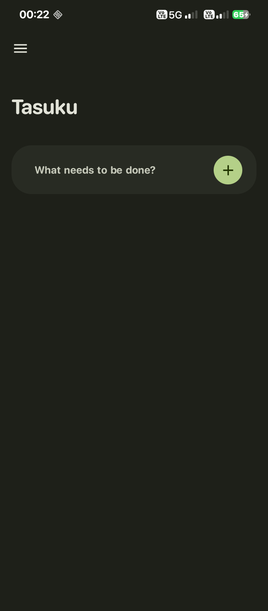
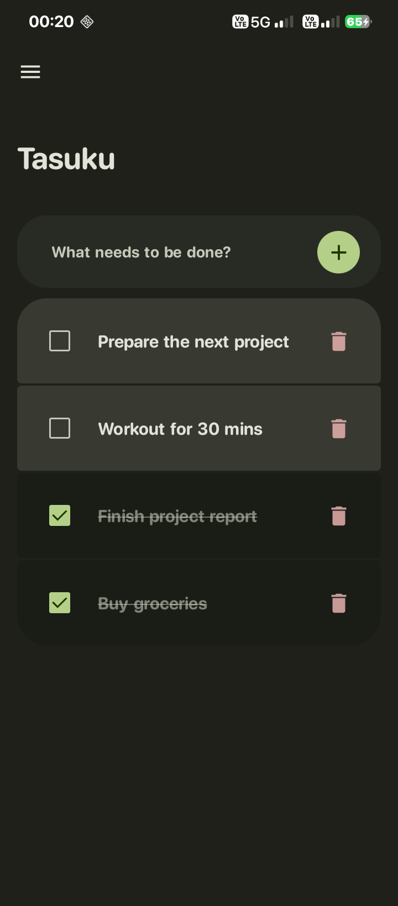
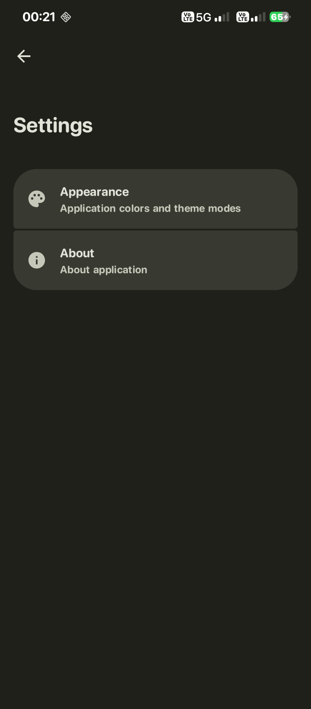
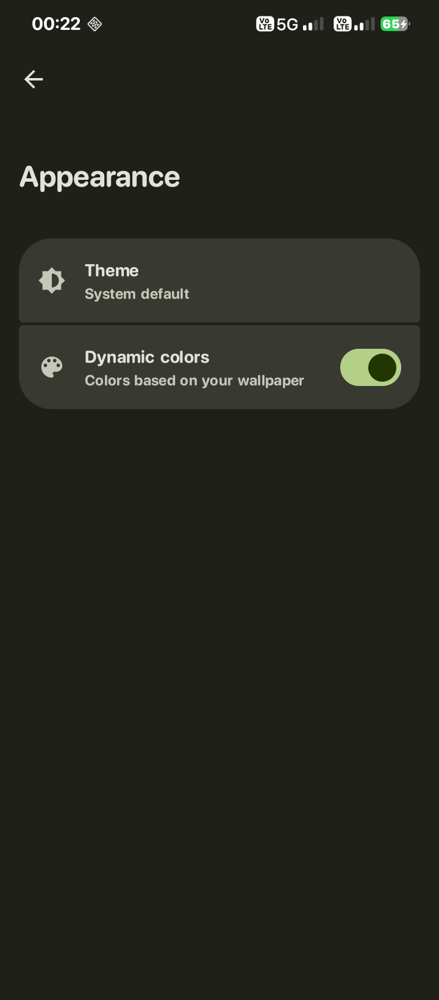
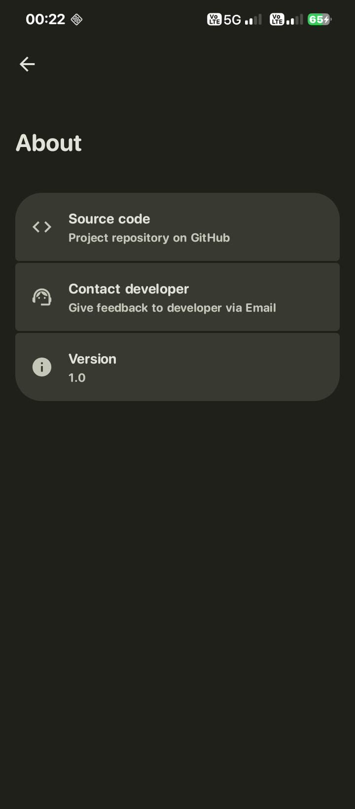

# Tasuku (タスク)

[](https://github.com/rimehrab/Tasuku/releases/latest)
[](https://github.com/rimehrab/Tasuku/actions/workflows/build.yml)
[](/LICENSE)

Tasuku is a minimalist, Android to-do application built with Kotlin and Jetpack Compose. It follows the "Material Expressive" design, prioritizing a clean, modern interface and a seamless user experience.

## ✨ Key features
* **Material 3 Expressive design:** Sleek and modern UI with fluid transitions and card-based layouts.
* **Dynamic color:** Seamlessly adapts to your wallpaper's color scheme on Android 12+ via Material You.
* **Theming modes:** Full support for Light, Dark, and System (auto-switching) themes.
* **Minimalist workflow:** Single-screen focus for quick task entry and management.
* **Offline-first:** All tasks are stored locally via Room Database — no accounts or network required.

## ⬇️ Downloads
*The app is currently in early development. You can download the latest debug APK from the GitHub Actions artifacts.*

## 🎨 Screenshots
|  |  |  |
|--------------------------------------------------------------------------------|--------------------------------------------------------------------------------|--------------------------------------------------------------------------------|
|  |  |

## 🧰 Build instructions
1. Clone this repository:
```bash
git clone https://github.com/rimehrab/tasuku.git
```
2. Open the project in IntelliJ IDEA Ultimate or Android Studio.
3. Sync Gradle files and resolve dependencies.
4. Run the project on an emulator or a physical device.

## 🛠️ Tech Stack
* **Programming language:** Kotlin
* **UI Framework:** Jetpack Compose
* **Design framework:** Material 3 Expressive
* **Architecture:** MVVM
* **Database:** Room (SQLite)
* **CI/CD:** GitHub Actions

## 📧 Contact
Feel free to reach out with questions or suggestions:
* Email: contact@rimehrab.is-a.dev

## 🙌 Special thanks to:  
* [hotarunichijou](https://github.com/hotarunichijou) for the idea of it.
* [syntaxspin](https://github.com/syntaxspin) for the amazing icon.
